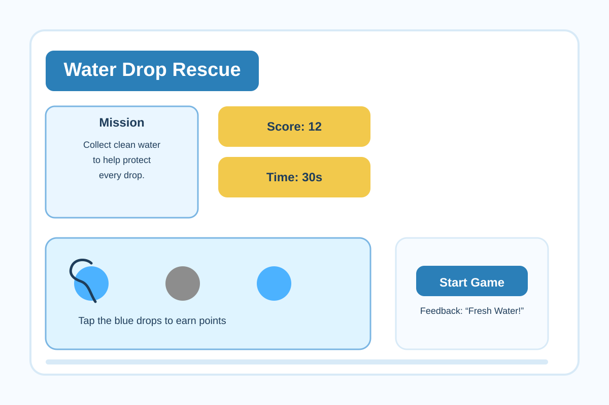

# Project 4 | charity: water Game Concept

## 1. Game Wireframe and Concept

### Game Title
Water Drop Rescue

### Game Idea
Water Drop Rescue is a simple tap-based web game designed to raise awareness about charity: water’s mission in a fun, approachable way for young people. Players collect falling blue water droplets to earn points while avoiding gray pollution droplets that subtract points. The game is fast, easy to understand, and visually tied to the charity: water brand through bright blue water visuals, yellow accents, and a clear call to action at the end.

### Why This Game Works
- It is simple enough to build with HTML, CSS, and JavaScript.
- It feels rewarding and playful while still communicating a meaningful message.
- It uses familiar game logic that is easy for users to learn quickly.

### Wireframe / Mockup

### Screen Layout Plan
- Top bar: game title, score, and timer
- Center play area: falling droplets moving downward
- Left side: mission message and instructions
- Bottom: start/restart button and feedback text
- End screen: final score, mission message, and restart option

## 2. Game Logic

### Water Drop Rescue - Game Logic
1. Game Start:
   - When the game loads, the title screen appears with a start button, score display, timer display, and instructions.
   - The play area is shown with a simple background and a set of falling droplets.
2. Player Actions:
   - The player taps or clicks on blue water droplets to collect them.
   - The player avoids clicking gray pollution droplets.
3. Game Logic:
   - Clean droplets increase the score and create a positive visual effect.
   - Pollution droplets decrease the score and trigger a warning message.
   - The game continues until the timer ends.
4. Score/Feedback:
   - The score updates instantly when the player collects or misses droplets.
   - Visual feedback includes color changes, popping animations, and short text messages such as “Fresh Water!” or “Pollution Warning!”
5. Win or Lose Conditions:
   - The game ends when the timer reaches zero.
   - The final screen shows the player’s score and a mission-themed message about helping provide clean water.
6. Reset/Replay:
   - The player can press the restart button to play again.
   - Resetting the game clears the score, restarts the timer, and repositions the droplets.

## 3. Note for charity: water Stakeholders

Hi charity: water team,

I created a game concept called Water Drop Rescue to help raise awareness among young people in a fun and memorable way. The experience is simple: players tap falling clean-water droplets while avoiding pollution droplets, earning points and learning that access to safe water is something worth protecting. The game uses bright blue and yellow visuals inspired by the charity: water brand, and the end screen can include a clear link back to the charity: water website for users who want to learn more or get involved.

This concept is easy to build as a web-based game and has strong potential for engagement because it combines quick gameplay with a meaningful mission. I believe it could be a strong way to introduce the organization’s work to students in a format that feels light, playful, and shareable.

Best,
Project Team

## 4. Reflection

Wireframing this game helped me focus on what matters most: making the experience simple, readable, and fun. I was surprised by how much the layout and feedback details shaped the whole feel of the experience, even before the game logic was built. I used AI to help brainstorm game concepts, refine the mechanics, and make sure the logic was clear and realistic for a small web project. I learned that a strong wireframe makes future coding much easier because it clarifies the screen structure and player interactions early on. If I did this again, I would probably create a few more variations of the layout so I could compare different versions before settling on one.

## 5. Level-Up Notes

No dedicated wireframing tool was used for this submission, but the mockup was created as a polished digital wireframe to clearly represent the intended screen layout and gameplay.
